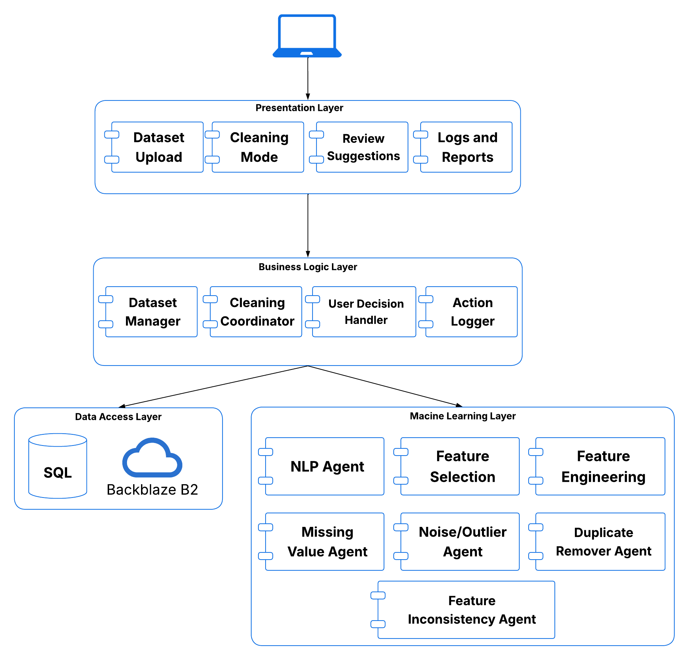

# AutoPrepAI

## 1. Project Overview

AutoPrepAI is an automated data preprocessing pipeline designed to clean and prepare tabular datasets (CSV/Excel) for machine learning and data analysis. The project addresses the common challenge of handling messy datasets by automating preprocessing tasks that would otherwise require significant manual effort and coding expertise. Built around six specialized agents, AutoPrepAI combines intelligent automation with user oversight to deliver clean, analysis-ready data. To ensure transparency and trust, every preprocessing action is logged and explained, allowing users to understand what changes were made and why before producing the final dataset.

The pipeline is powered by 6 specialized agents, each responsible for a distinct preprocessing task:

- **Data Standardizer**: corrects type inconsistencies and normalizes categorical spelling and value formats
- **Duplicate Remover**: detects and eliminates both exact and semantically similar records
- **Outlier Filter**: identifies and removes anomalies using configurable detection strategies
- **Missing Value Handler**: fills gaps in your data using strategies like mean, median, KNN, MICE, or categorical mode
- **Feature Engineer**: suggests new meaningful features using an LLM-backed service
- **Feature Selector**: handles numerical scaling, categorical encoding, and irrelevant feature removal

AutoPrepAI offers three ways to interact with the pipeline:

- **Chat Mode**: type a plain-English command and the system uses DSPy and a Groq-hosted LLM to parse your intent and trigger the right agents automatically
- **Auto Mode**: the pipeline runs end-to-end on your uploaded dataset without any input needed, detecting and fixing issues across all six agents in sequence
- **Manual Mode**: select and configure each preprocessing step yourself for full control over what gets applied

Across all modes, every action is logged, explained, and subject to user approval, allowing users to accept or reject individual preprocessing steps before the final cleaned dataset is produced.

## 2. System Architecture



AutoPrepAI follows a layered architecture consisting of a React-based presentation layer, a FastAPI business logic layer, a data access layer for persistence and storage, and a machine learning layer containing specialized preprocessing agents.

## 3. Tech Stack

### Languages

* Python
* JavaScript / JSX

### Backend

* FastAPI
* Streamlit
* PostgreSQL
* SQLAlchemy
* DSPy
* Groq API
* Scikit-learn and other data science libraries

### Frontend

* React 18
* React Router
* React Markdown

### Storage & Services

* Backblaze B2 (S3-compatible object storage)
* SMTP Email Service

## 4. Getting Started

### Prerequisites

- Python 3.13
- Node.js and npm for the React frontend.
- PostgreSQL if running the FastAPI backend with authentication/conversation history.
- A Groq API key for LLM-backed components.
- Backblaze B2 credentials if using the FastAPI upload/download flow.
- SMTP credentials if using email verification and password reset.

### Installation

Clone the repository:

```bash
git clone https://github.com/Hassannetsha/AutoPrepAI.git
cd AutoPrepAI
```

Create and activate a Python virtual environment:

```bash
python -m venv .venv
```

On Windows PowerShell:

```powershell
.venv\Scripts\Activate.ps1
```

Install Python dependencies:

```bash
pip install -r installs.txt
```

Install frontend dependencies:

```bash
cd Frontend/autoprepai-ui
npm install
```

### Environment Variables

Create a `.env` file in the project root and configure the required variables:

```env
GROQ_API_KEY=your_groq_api_key
DATABASE_URL=your_database_url
REACT_APP_API_BASE_URL=http://localhost:8022
```

Additional credentials may be required for optional services such as Backblaze B2 storage and SMTP email delivery.


### Running the Project
FastAPI Backend + React Frontend

Start the backend:

```bash
uvicorn backend.main:app --reload --host 127.0.0.1 --port 8022
```

Start the frontend in a second terminal:

```bash
cd Frontend/autoprepai-ui
npm start
```

The React app defaults to `http://localhost:3000` and calls the backend at `http://localhost:8022` unless `REACT_APP_API_BASE_URL` is set.

## 5. Usage Guide

1. Start the backend and frontend applications.
2. Sign in to your account.
3. Upload a CSV or Excel dataset.
4. Choose one of the available modes:

   * **Chat Mode**: describe the preprocessing task in natural language.
   * **Auto Mode**: automatically clean and preprocess the dataset.
   * **Manual Mode**: select the preprocessing operations to apply.
5. Review the generated preprocessing actions and logs.
6. Approve or reject suggested changes.
7. Download the cleaned dataset.

### Example Workflow

```text
Upload Dataset
      ↓
Choose Mode
      ↓
Run Preprocessing Agents
      ↓
Review Suggested Changes
      ↓
Approve / Reject Actions
      ↓
Download Cleaned Dataset
```
