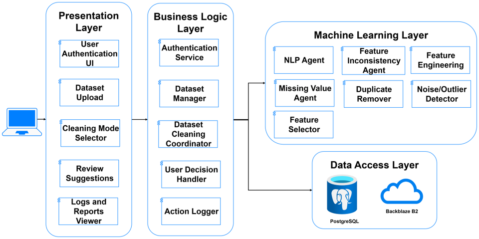

<div align="center">

# AutoPrepAI

**An automated, multi-agent data preprocessing pipeline for tabular datasets.**

[](#)
[](#)
[](#)
[](#)
[](#)
[](#)

[Overview](#overview) • [Features](#features) • [Architecture](#architecture) • [Tech Stack](#tech-stack) • [Getting Started](#getting-started) • [Usage](#usage-guide)

</div>

---

## Overview

AutoPrepAI is an automated data preprocessing pipeline that cleans and prepares tabular datasets (CSV/Excel) for machine learning and data analysis. It replaces the manual, code-heavy work of dataset cleaning with **six specialized agents** working under a single, transparent pipeline — every action is logged and explained, and nothing is applied without user approval.

## Features

| Agent | What it does |
|---|---|
| 🧹 **Data Standardizer** | Corrects type inconsistencies and normalizes categorical spelling/value formats |
| 🔁 **Duplicate Remover** | Detects and removes exact *and* semantically similar duplicate records |
| 📉 **Outlier Filter** | Identifies and removes anomalies using configurable detection strategies |
| 🧩 **Missing Value Handler** | Fills gaps using mean, median, KNN, MICE, or categorical mode |
| 🛠️ **Feature Engineer** | Suggests new, meaningful features using an LLM-backed service |
| 🎯 **Feature Selector** | Handles numerical scaling, categorical encoding, and irrelevant feature removal |

### Three ways to work

| Mode | Best for |
|---|---|
| 💬 **Chat Mode** | Type a plain-English command — DSPy + a Groq-hosted LLM parses your intent and triggers the right agents |
| ⚡ **Auto Mode** | Runs the full pipeline end-to-end with no input needed, across all six agents in sequence |
| 🎛️ **Manual Mode** | Select and configure each preprocessing step yourself for full control |

Across all three modes, every action is logged, explained, and subject to your approval before the final cleaned dataset is produced.

## Architecture



AutoPrepAI follows a layered architecture:

```
React (presentation) → FastAPI (business logic) → Data access (persistence/storage) → ML layer (preprocessing agents)
```

## Tech Stack

| Layer | Technologies |
|---|---|
| **Languages** | Python, JavaScript / JSX |
| **Backend** | FastAPI, Streamlit, PostgreSQL, SQLAlchemy, DSPy, Groq API, Scikit-learn |
| **Frontend** | React 18, React Router, React Markdown |
| **Storage & Services** | Backblaze B2 (S3-compatible), SMTP email service |

## Getting Started

### Prerequisites

- Python 3.13
- Node.js and npm (for the React frontend)
- PostgreSQL (if running the FastAPI backend with auth/conversation history)
- A Groq API key (for LLM-backed components)
- Backblaze B2 credentials (if using the upload/download flow)
- SMTP credentials (if using email verification / password reset)

### Installation

**1. Clone the repository**
```bash
git clone https://github.com/Hassannetsha/AutoPrepAI.git
cd AutoPrepAI
```

**2. Create and activate a virtual environment**
```bash
python -m venv .venv
```
Windows (PowerShell):
```powershell
.venv\Scripts\Activate.ps1
```

**3. Install backend dependencies**
```bash
pip install -r installs.txt
```

**4. Install frontend dependencies**
```bash
cd Frontend/autoprepai-ui
npm install
```

### Environment Variables

Create a `.env` file in the project root:

```env
GROQ_API_KEY=your_groq_api_key
DATABASE_URL=your_database_url
REACT_APP_API_BASE_URL=http://localhost:8022
```
Additional credentials may be required for optional services (Backblaze B2, SMTP).

### Running the Project

Start the backend:
```bash
uvicorn backend.main:app --reload --host 127.0.0.1 --port 8022
```

Start the frontend (in a second terminal):
```bash
cd Frontend/autoprepai-ui
npm start
```

The React app runs at `http://localhost:3000` and calls the backend at `http://localhost:8022` unless `REACT_APP_API_BASE_URL` is set.

## Usage Guide

1. Start the backend and frontend applications
2. Sign in to your account
3. Upload a CSV or Excel dataset
4. Choose a mode — **Chat**, **Auto**, or **Manual**
5. Review the generated preprocessing actions and logs
6. Approve or reject suggested changes
7. Download the cleaned dataset

**Workflow:**
```
Upload Dataset → Choose Mode → Run Preprocessing Agents → Review Changes → Approve/Reject → Download Cleaned Dataset
```

---

<div align="center">

Built as a graduation project — Faculty of Computing and Artificial Intelligence, Cairo University

</div>
